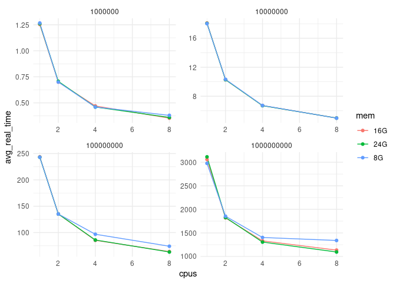

# Plot results

## Data

Load results.

``` r
library(readr)
res <- read_csv(
  file = "results/i7-9700.csv",
  col_names = c('lines', 'replicate', 'cpus', 'mem', 'real_time'),
  col_types = cols('i', 'i', 'i', 'c', 'd')
)
head(res)
```

    # A tibble: 6 × 5
        lines replicate  cpus mem   real_time
        <int>     <int> <int> <chr>     <dbl>
    1 1000000         1     1 8G         1.26
    2 1000000         1     1 16G        1.25
    3 1000000         1     1 24G        1.26
    4 1000000         1     2 8G         0.7 
    5 1000000         1     2 16G        0.7 
    6 1000000         1     2 24G        0.7 

Average arcoss replicates.

``` r
library(dplyr)
```


    Attaching package: 'dplyr'

    The following objects are masked from 'package:stats':

        filter, lag

    The following objects are masked from 'package:base':

        intersect, setdiff, setequal, union

``` r
res |>
  group_by(lines, cpus, mem) |>
  summarise(avg_real_time = mean(real_time)) -> res_avg
```

    `summarise()` has grouped output by 'lines', 'cpus'. You can override using the
    `.groups` argument.

``` r
head(res_avg)
```

    # A tibble: 6 × 4
    # Groups:   lines, cpus [2]
        lines  cpus mem   avg_real_time
        <int> <int> <chr>         <dbl>
    1 1000000     1 16G           1.25 
    2 1000000     1 24G           1.26 
    3 1000000     1 8G            1.27 
    4 1000000     2 16G           0.7  
    5 1000000     2 24G           0.707
    6 1000000     2 8G            0.7  

## Results

Plot.

``` r
library(ggplot2)
ggplot(res_avg, aes(cpus, avg_real_time, colour = mem)) +
  geom_line() +
  geom_point() +
  facet_wrap(~lines, scales = "free") +
  theme_minimal()
```



Best settings for sorting one billion lines.

``` r
res_avg |>
  filter(lines == 1000000000) |>
  arrange(avg_real_time) |>
  head(10)
```

    # A tibble: 10 × 4
    # Groups:   lines, cpus [4]
            lines  cpus mem   avg_real_time
            <int> <int> <chr>         <dbl>
     1 1000000000     8 24G           1095.
     2 1000000000     8 16G           1134.
     3 1000000000     4 24G           1305.
     4 1000000000     4 16G           1331.
     5 1000000000     8 8G            1339.
     6 1000000000     4 8G            1402.
     7 1000000000     2 16G           1819.
     8 1000000000     2 24G           1827.
     9 1000000000     2 8G            1854.
    10 1000000000     1 8G            2977.

## Summary

- More CPUs decreases the time it needs to sort but the decrease
  approaches a plateau.
- For files with less lines to sort, changing the buffer size has no
  effect. With larger files, increasing the buffer results in a decrease
  in sorting time.
- Using the more resources (8 CPUs and 24G memory) had the best
  performance. However, note that using more CPUs with less memory (8
  and 8G) was a bit slower than less CPUs with more memory (4 and 24G)
  suggesting that when using more CPUs, make sure there is enough
  memory.
